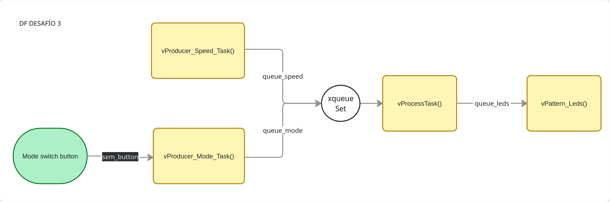
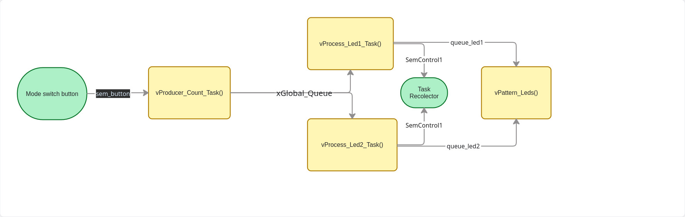
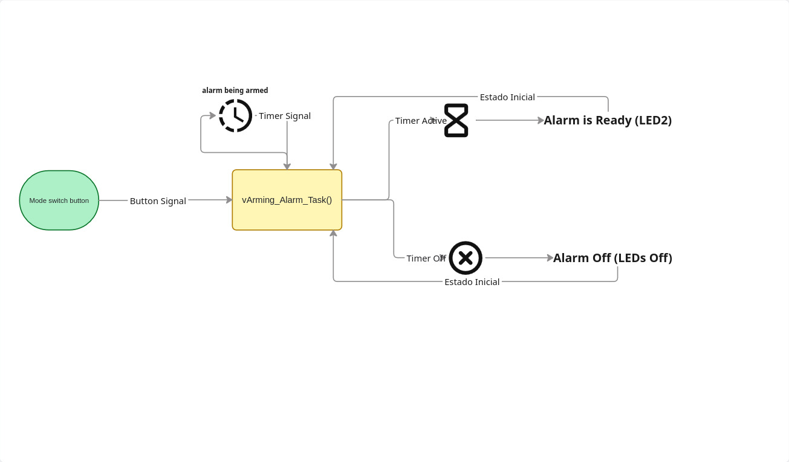

# real-time-systems-course Guía 2 de Trabajos Prácticos
practical exercises and projects of the real-time systems course

Estoy organizando mi repositorio de github de estos trabajos voy a tener una carpeta con reportes de cada guía de trabajo, la idea es tener un readme.md que me introduzca el repositorio guiando a cada reporte por cada guía de trabajo que son las siguientes:

## Desafío 1

**Preguntas**: Transferir datos entre tareas de forma segura. ¿Qué sucede si la tarea consumidora es más lenta que la productora? ¿Cómo
afecta el tamaño de la cola?

### Análisis: 

Aca introducimos las colas como mecanismo de envío de datos desde una tarea productora a una consumidora.

```c
void HAL_GPIO_EXTI_Callback(uint16_t GPIO_Pin){
	if(GPIO_Pin == GPIO_PIN_0){
		BaseType_t xHigherPriorityTaskWoken = pdFALSE;
		xSemaphoreGiveFromISR(semaphored_button, &xHigherPriorityTaskWoken);
		portYIELD_FROM_ISR(xHigherPriorityTaskWoken);
	}

}
void vProducerTask(void * pvParameters){
	uint16_t button_count = 0;

	while(1){
		if(xSemaphoreTake(semaphored_button, portMAX_DELAY) == pdPASS){
			button_count ++;
			xQueueSend(queue_button, &button_count, portMAX_DELAY);
		}
	}
}
void vConsumerTask(void * pvParameters){
	Led_Param_t *pxParam = (Led_Param_t *) pvParameters;
	uint16_t count_receive = 0;
	uint8_t leds[4];

	while(1){
		if(xQueueReceive(queue_button, &count_receive, portMAX_DELAY) == pdPASS){
			leds[0] = (count_receive / 1) % 2;
			leds[1] = (count_receive / 2) % 2;
			leds[2] = (count_receive / 4) % 2;
			leds[3] = (count_receive / 8) % 2;

			for (int var = 0; var < 4; ++var) {
				if(leds[var] == 1){
					HAL_GPIO_WritePin(pxParam[var].GPIO_puerto, pxParam[var].GPIO_pin, GPIO_PIN_SET);
				}else{
					HAL_GPIO_WritePin(pxParam[var].GPIO_puerto, pxParam[var].GPIO_pin, GPIO_PIN_RESET);
				}
			}
		}
	}
}
```

Si la tarea Consumidora es más lenta (por ejemplo, porque tarda en procesar el dato o controlar los LEDs), la `Queue` comenzará a llenarse. El comportamiento exacto dependerá del parámetro `xTicksToWait`  de la función `xQueueSend()` en la tarea Productora. El tamaño de la cola actúa como un amortiguador o pequeño buffer para gestionar ráfagas de datos, pero aumentar el tamaño de la cola no soluciona el problema si la tasa media de producción es consistentemente mayor que la tasa media de consumo. En ese caso, sin importar cuán grande sea la cola, eventualmente se llenará.


## Desafío 2

**Preguntas**: Gestionar múltiples datos en un solo mensaje. Comparar el uso de memoria de enviar una estructura por copia frente a enviar un
puntero a la estructura.

### Análisis: 

En este desafío introducimos un concepto importante que es el manejo de memoria ya que muchas veces el hardware donde corre nuestra aplicación tiene recursos limitados. Para ello hicimos una estructura con datos basura para simular un sensor pesado y tareas espejos pero que manejan los datos de diferentes forma y calculamos aproximadamente cuanto nos ahorramos de memoria.

```c
typedef struct {
	uint16_t Led_ID;  // 0 a 3 para los 4 Leds
	uint16_t on_off; // 1 ON y 2 OFF

	uint64_t basura; // simulamos otros datos basura
	float basura2;
	float basura3;
	uint64_t basura4;

}Led_Switch_t;

void vProducerTask(void * pvParameters){
	Led_Switch_t pattern_send;
	Led_Switch_t *px_pattern = (Led_Switch_t *) pvParameters;

	while(1){
		for (int var = 0; var < 10; ++var) {
			pattern_send = px_pattern[var];
			xQueueSend(queue_led_pattern, &pattern_send, portMAX_DELAY);
			vTaskDelay(pdMS_TO_TICKS(500));
		}
	}
}
void vConsumerTask(void * pvParameters){
	Led_Param_t *pxParam = (Led_Param_t *) pvParameters;
	Led_Switch_t pattern_received;

	while(1){
		if(xQueueReceive(queue_led_pattern, &pattern_received, portMAX_DELAY) == pdPASS){

			if(pattern_received.on_off == 1){
				HAL_GPIO_WritePin(pxParam[pattern_received.Led_ID].GPIO_puerto, pxParam[pattern_received.Led_ID].GPIO_pin, GPIO_PIN_SET);
			}else{
				HAL_GPIO_WritePin(pxParam[pattern_received.Led_ID].GPIO_puerto, pxParam[pattern_received.Led_ID].GPIO_pin, GPIO_PIN_RESET);
			}
			vTaskDelay(pdMS_TO_TICKS(500));
		}
	}
}
void vProducer_PointerTask(void * pvParameters){
    Led_Switch_t *px_pattern = (Led_Switch_t *) pvParameters;
    Led_Switch_t *px_pattern_send;

    while(1){
        for (int var = 0; var < 10; ++var) {
            px_pattern_send = &px_pattern[var];
            xQueueSend(queue_led_pattern_point, &px_pattern_send, portMAX_DELAY);

            vTaskDelay(pdMS_TO_TICKS(500));
        }
    }
}
void vConsumer_PointerTask(void * pvParameters){
    Led_Param_t *pxParam = (Led_Param_t *) pvParameters;
    Led_Switch_t *px_pattern_received;

    while(1){
        if(xQueueReceive(queue_led_pattern_point, &px_pattern_received, portMAX_DELAY) == pdPASS){
            if(px_pattern_received->on_off == 1){
                HAL_GPIO_WritePin(pxParam[px_pattern_received->Led_ID].GPIO_puerto, pxParam[px_pattern_received->Led_ID].GPIO_pin, GPIO_PIN_SET);
            }else{
                HAL_GPIO_WritePin(pxParam[px_pattern_received->Led_ID].GPIO_puerto, pxParam[px_pattern_received->Led_ID].GPIO_pin, GPIO_PIN_RESET);
            }
            vTaskDelay(pdMS_TO_TICKS(500));
        }
    }
}
```
Cuando FreeRTOS crea una cola (xQueueCreate), reserva memoria. La fórmula es: (Tamaño del item * Longitud de la cola) + Estructura de control de la cola.

- Opción 1: Paso por Valor (Estructura completa)

    Creación: xQueueCreate(10, sizeof(Led_Switch_t))

    Consumo de la cola: 10 items * 32 bytes/item = 320 bytes.

- Opción 2: Paso por Referencia (Punteros)

    Creación: xQueueCreate(10, sizeof(Led_Switch_t *))

    Tamaño de un puntero en STM32: Siempre 4 bytes (porque es un sistema de 32 bits).

    Consumo de la cola: 10 items * 4 bytes/item = 40 bytes.

Aca podemos ver como pasar una referencia de un dato nos ahorra mucho espacio de memoria RAM y ciclos de CPU ya que no gastamos en copiar cada estructura. 

## Desafío 3

**Preguntas**: ¿Qué ventaja tiene usar un Queue Set frente a realizar un "Polling" con un
xQueueReceive de tiempo de espera cero sobre cada cola? ¿Cómo influye el tamaño de
las colas individuales en el comportamiento del Set?

### Análisis: 

En este desafío vamos ver como podemos generar un flujo de datos donde las una tarea Procesadora espera datos de diversos orígenes y enviándola en el formato necesario a una tarea principal (la de LEDS).




```c
void vProducer_Speed_Task(void * pvParameters){
	TickType_t random_speed;
	while(1){
		random_speed = pdMS_TO_TICKS(100 + rand() % 901);
		xQueueSend(queue_speed, &random_speed, portMAX_DELAY);

		vTaskDelay(pdMS_TO_TICKS(3000));
	}
}
void vProducer_Mode_Task(void * pvParameters){
	Mode_t pMode = INITIAL_MODE;
	while(1){
		if(xSemaphoreTake(sem_button, portMAX_DELAY) == pdPASS){
			if(pMode == 'D'){
				pMode = 'I';
			}else{
				pMode = 'D';
			}
			xQueueSend(queue_mode, &pMode, portMAX_DELAY);
			// Bloqueamos la tarea 200ms para ignorar ruidos mecánicos.
			vTaskDelay(pdMS_TO_TICKS(100));

			// "Limpiamos" el semáforo por si la interrupción se disparó
			// durante los 200ms de delay y dejó el semáforo en verde de forma errónea.
			xSemaphoreTake(sem_button, 0);
		}
	}
}
void vProcessTask(void * pvParameters){
	TickType_t speed = INITIAL_SPEED;
	Mode_t mode = INITIAL_MODE;
	Led_pattern_t pattern;

	QueueSetMemberHandle_t xActivatedMember;
	while(1){
		xActivatedMember = xQueueSelectFromSet(xqueueSet, portMAX_DELAY);

		if(xActivatedMember == queue_speed){

			xQueueReceive(queue_speed, &speed, 0);
			pattern.delay = speed;
			pattern.mode_L_or_R = mode;

		}else if(xActivatedMember == queue_mode){

			xQueueReceive(queue_mode, &mode, 0);
			pattern.delay = speed;
			pattern.mode_L_or_R = mode;
		}
		xQueueSend(queue_leds, &pattern, 0);
	}
}
void vPattern_Leds(void * pvParameters){
	Led_pattern_t led_Pattern;
	Led_pattern_t aux;
	led_Pattern.delay = INITIAL_SPEED;
	led_Pattern.mode_L_or_R = INITIAL_MODE;
	int8_t led_pos = 0;
	TickType_t xLastWakeTime = xTaskGetTickCount();
	while(1){
		while(xQueueReceive(queue_leds, &aux, 0) == pdPASS){
			led_Pattern.delay = aux.delay;
			led_Pattern.mode_L_or_R = aux.mode_L_or_R;
		}

		// Lógica de desplazamiento
		if(led_Pattern.mode_L_or_R == 'D') {
			led_pos++;
			if(led_pos > 3) led_pos = 0;
		} else {
			led_pos--;
			if(led_pos < 0) led_pos = 3;
		}

		// Apagar todos los LEDs
		for (int var = 0; var < 4; ++var) {
			HAL_GPIO_WritePin(leds_param[var].GPIO_puerto, leds_param[var].GPIO_pin, GPIO_PIN_RESET);
		}

		// Encender el correspondiente
		if(led_pos == 0) HAL_GPIO_WritePin(leds_param[0].GPIO_puerto, leds_param[0].GPIO_pin, GPIO_PIN_SET);
		if(led_pos == 1) HAL_GPIO_WritePin(leds_param[1].GPIO_puerto, leds_param[1].GPIO_pin, GPIO_PIN_SET);
		if(led_pos == 2) HAL_GPIO_WritePin(leds_param[2].GPIO_puerto, leds_param[2].GPIO_pin, GPIO_PIN_SET);
		if(led_pos == 3) HAL_GPIO_WritePin(leds_param[3].GPIO_puerto, leds_param[3].GPIO_pin, GPIO_PIN_SET);

		vTaskDelayUntil(&xLastWakeTime ,led_Pattern.delay);
	}
}
```
1. Ventaja del Queue Set frente al "Polling"
**Polling**: Desperdicia ciclos de reloj manteniendo la CPU preguntando continuamente si hay datos por mas que usemos vTaskDelay(), lo que roba tiempo de procesamiento a tareas de menor prioridad (CPU Starvation).
**Queue Set**: Permite que la tarea pase al estado Blocked mientras espera. Cuando llega un dato, el RTOS la despierta instantáneamente, logrando una respuesta inmediata sin desperdiciar energía.


2. Influencia del tamaño de las colas en el Set
Lo mas importante es que el tamaño del *Queue Set* debe ser exactamente la suma de las capacidades máximas de las colas que contiene (Ej: Cola A(4) + Cola B(4) = Set(8)).
El Comportamiento: El *Queue Set* guarda notificaciones (punteros a los Handle de las Queue). Si su tamaño fuera menor a esta suma y ocurre una ráfaga donde todas las colas se llenan simultáneamente, el Set se desbordaría internamente, provocando que el RTOS pierda datos y el sistema sufra un error fatal (cuelgue / configASSERT).


## Desafío 4

**Preguntas**: ¿Qué sucede si una tarea usa xQueueReceive() en lugar de xQueuePeek()?
¿Cómo se aseguran de que ambas tareas leyeron el mismo dato antes de que este sea
eliminado de la cola?

### Análisis: 

En este desafío vamos ver como podemos generar un flujo de datos donde múltiples tareas accedan a la misma información sin "consumirla" de
la cola, permitiendo un procesamiento paralelo de un mismo evento. Simulando un `Mail Box`.



```c
void vProducerCountTask(void * pvParameters){
	uint16_t aux_count = 0;
	while(1){

		if(xSemaphoreTake(xSemButton, portMAX_DELAY) == pdPASS){
			aux_count = aux_count + 1;
			xQueueOverwrite(xGlobalQueue, &aux_count);
			// Bloqueamos la tarea 50ms para ignorar ruidos mecánicos.
			vTaskDelay(pdMS_TO_TICKS(300));
			// "Limpiamos" el semáforo por si la interrupción se disparó
			// durante los 200ms de delay y dejó el semáforo en verde de forma errónea.
			xSemaphoreTake(xSemButton, 0);
		}
	}
}
void vProcessLed1Task(void *pvParameters){
	uint16_t count_peek = 0;
	uint16_t led_pos = 0;

	while(1){
		xQueuePeek(xGlobalQueue, &count_peek, portMAX_DELAY);
		led_pos = count_peek % 2;
		if(led_pos == 1 ){
			xQueueSend(xQueueLed1, &led_pos, 0);
		}
		xSemaphoreGive(xSemControl1);

		vTaskDelay(pdMS_TO_TICKS(100));
	}
}
void vProcessLed2Task(void *pvParameters){
	uint16_t count_peek = 0;
	uint16_t led_pos = 0;

	while(1){
		xQueuePeek(xGlobalQueue, &count_peek, portMAX_DELAY);
		led_pos = count_peek % 2;
		if(led_pos == 0 ){
			xQueueSend(xQueueLed2, &led_pos, 0);
		}
		xSemaphoreGive(xSemControl2);
		vTaskDelay(pdMS_TO_TICKS(100));
	}
}
void vTrashCountTask(void *pvParameters){
	uint16_t aux_trash_count;

	while(1){
		xSemaphoreTake(xSemControl1, portMAX_DELAY);
		xSemaphoreTake(xSemControl2, portMAX_DELAY);

		xQueueReceive(xGlobalQueue, &aux_trash_count, 0);
	}
}

void vPattern_Leds(void * pvParameters){
	int8_t led_pos = 3;
	TickType_t xLastWakeTime = xTaskGetTickCount();
	QueueSetMemberHandle_t xActivatedMember;
	while(1){
		xActivatedMember = xQueueSelectFromSet(xQueueSet, portMAX_DELAY);
		if(xActivatedMember == xQueueLed1){
			xQueueReceive(xQueueLed1, &led_pos, 0);
		}else if(xActivatedMember == xQueueLed2){
			xQueueReceive(xQueueLed2, &led_pos, 0);
		}

		// Apagar todos los LEDs
		for (int var = 0; var < 4; ++var) {
			HAL_GPIO_WritePin(leds_param[var].GPIO_puerto, leds_param[var].GPIO_pin, GPIO_PIN_RESET);
		}

		// Encender el correspondiente
		if(led_pos == 0) HAL_GPIO_WritePin(leds_param[0].GPIO_puerto, leds_param[0].GPIO_pin, GPIO_PIN_SET);
		if(led_pos == 1) HAL_GPIO_WritePin(leds_param[2].GPIO_puerto, leds_param[2].GPIO_pin, GPIO_PIN_SET);

		vTaskDelayUntil(&xLastWakeTime, pdMS_TO_TICKS(100));
	}
}
```
1. ¿Qué sucede si una tarea usa xQueueReceive() en lugar de xQueuePeek()?
En nuestra implementación tenemos bien definida las tareas como Productora, Procesadores y de Recolección, en estos sistema estilo `Mail Box` lo importante es que las tareas solo tengan acceso a la información sin consumirla ya que podrían crear una desincronización o un mal funcionamiento ya que dejarían a otra tarea Procesadora sin poder acceder a dicha información.

2. ¿Cómo se aseguran de que ambas tareas leyeron el mismo dato antes de que este sea eliminado de la cola?
Para poder arbitrar el uso de la información nos aseguramos de dos maneras: Primero utilizando un servicio de Queues como `xQueuePeek()` que copia el contenido y no lo borra para que pueda ser tomado por cualquier otra tarea que tenga acceso a la Queue. Y segundo habilitando un conjuntos de semáforos para que una tarea auxiliar de Recolección se encarga de eliminar el dato viejo que ya fue tomado por todos los Procesadores. 


## Desafío 5
**preguntas:** ¿Qué sucede con el LED2 si el usuario presiona el botón repetidamente cada 2
segundos? ¿LED1 se vio afectado por la lógica de LED2? ¿La función de callback puede
utilizar vTaskDelay()? ¿Por qué?

### Análisis 

En este desafío implementamos los `Software Timers` mas precisamente un mecanismos de *Watchdog* de software para desactivar procesos
tras inactividad. Luego explicamos el funcionamiento y la robustez de usar Software Timers 

```c
  xWatchDogTimer = xTimerCreate(
		  "Whatch Dog",
		  pdMS_TO_TICKS(5000),
		  pdFALSE,
		  (void *)0,
		  prvWatchDogTimerCallback);

  xTimerOutTimer = xTimerCreate(
		  "Time Out Led3",
		  pdMS_TO_TICKS(1000),
		  pdFALSE,
		  (void *)1,
		  prvTimeOutTimer);

void prvWatchDogTimerCallback(TimerHandle_t xTimer){

	HAL_GPIO_WritePin(leds_param[1].GPIO_puerto, leds_param[1].GPIO_pin, GPIO_PIN_RESET);
	HAL_GPIO_WritePin(leds_param[2].GPIO_puerto, leds_param[2].GPIO_pin, GPIO_PIN_SET);
	xTimerStart(xTimerOutTimer, 0);

}
void prvTimeOutTimer(TimerHandle_t xTimer){
	HAL_GPIO_WritePin(leds_param[2].GPIO_puerto, leds_param[2].GPIO_pin, GPIO_PIN_RESET);
}
void vBlinkyLed1(void *pvParameters){
	while(1){
		HAL_GPIO_TogglePin(leds_param[0].GPIO_puerto, leds_param[0].GPIO_pin);
		vTaskDelay(pdMS_TO_TICKS(leds_param[0].delay));
	}
}
void vWatchDogLed2(void *pvParameters){
	HAL_GPIO_WritePin(leds_param[1].GPIO_puerto, leds_param[1].GPIO_pin, GPIO_PIN_RESET);

	while(1){
		xSemaphoreTake(xSemButton, portMAX_DELAY);
		HAL_GPIO_WritePin(leds_param[1].GPIO_puerto, leds_param[1].GPIO_pin, GPIO_PIN_SET);

		xTimerReset(xWatchDogTimer, 0);
	}
}
```
1. 
¿Qué sucede con el LED2 si el usuario presiona el botón repetidamente cada 2 segundos?
El temporizador nunca llegará a expirar. Cada vez que se presiona el botón a los 2 segundos, `xTimerReset` resetea el vencimiento otros 5 segundos. Por lo tanto, el LED2 permanecerá encendido indefinidamente (o hasta que el usuario deje de presionar el botón por más de 5 segundos seguidos).

2. ¿LED1 se vio afectado por la lógica de LED2?
**NO** ya que la tarea vBlinkyLed1 corre en su propio contexto de ejecución, totalmente independiente. Mientras la tarea del LED2 se bloquea esperando un semáforo, el *Scheduler* le entrega la CPU a la tarea del LED1 para que siga parpadeando.

3. ¿La función de callback puede utilizar vTaskDelay()? ¿Por qué?
Definitivamente **NO** por que como vimos en la clase teórica, las funciones callback de los Timers no son tareas independientes, se ejecutan dentro de una única tarea del sistema llamada `Daemon Task`.Si ponemos un `vTaskDelay()` dentro de un callback, bloqueamos a la Demon Task y producirá que los otros timers del sistema funcionen mal o pierdan su determinismo.


## Desafío 6
**preguntas:** Comparar el consumo de Stack de este diseño frente a una tarea que haga lo
mismo con un bucle y vTaskDelay(). ¿Dónde reside la lógica de conmutación del LED en
este desafío?

### Análisis 

En este desafío vamos a utilizar un `Software Timer` para crear un mecanismo periódico que realiza un rutina de *Blinky Led*, que cambia dicho periodo por una interrupción de pulsador. Luego vamos a comparar con el uso de tareas auxiliares en vez de Software Timers.

```c
  xMetronomoTimer = xTimerCreate(
		  "Metronomo",
		  pdMS_TO_TICKS(1000),
		  pdTRUE,
		  (void *)0,
		  prvMetronomoCallback);

void prvMetronomoCallback(TimerHandle_t xTimer){
	HAL_GPIO_TogglePin(leds_param[3].GPIO_puerto, leds_param[3].GPIO_pin);

}
void vChangePeriodTask(void *pvParameters){
	TickType_t new_period;
	new_period = xTimerGetPeriod(xMetronomoTimer);

	while(1){
		xSemaphoreTake(xSemButton, portMAX_DELAY);
		new_period = xTimerGetPeriod(xMetronomoTimer);
		if (new_period > pdMS_TO_TICKS(125)){
			new_period = new_period / 2;
			xTimerChangePeriod(xMetronomoTimer, new_period, portMAX_DELAY);
		}else{
			new_period = pdMS_TO_TICKS(1000);
			xTimerChangePeriod(xMetronomoTimer, new_period, portMAX_DELAY);
		}

		// anti-bouncing
		vTaskDelay(pdMS_TO_TICKS(100));
		xSemaphoreTake(xSemButton, 0);
	}
}
```

Usando una Tarea con `vTaskDelay()` como por ej. vTareaBlinky con un bucle infinito y el delay para conmutar el LED, FreeRTOS habría tenido que asignar Un TCB (BLoque de control) y el stack propio de la tarea que significa un gran gasto para eventos periódicos o de one shot.
Mientras que si utilizamos un `Software Timer` no estamos gastando en TCB o Stack, porque los Timers de FreeRTOS no tienen su propio Stack todos los Timers del sistema comparten el mismo Stack de la `Demon Task` encargada de gestionarlos. 
Por otro lado la lógica de conmutación esta implementada en la callback del Software Timer `prvMetronomoCallback()` pero reside y se ejecuta en el contexto de la Tarea Demonio de FreeRTOS (RTOS Daemon Task o Timer Service Task).


## Desafío 7
**preguntas:** Cómo se comunican los timers entre sí o con el resto del sistema? ¿Es seguro
modificar el periodo o detener un timer desde el callback de otro timer?

### Análisis 



```c
void prvAutoReloadAlarmCallback(TimerHandle_t xTimer){
	HAL_GPIO_TogglePin(leds_param[LED_PRE_ARMADO].GPIO_puerto, leds_param[LED_PRE_ARMADO].GPIO_pin);
}
void prvOneShotAlarmCallback(TimerHandle_t xTimer){
	xTimerStop(xAutoReloadAlarmTimer, 0);
	xTaskNotify(xArmingTaskHandle, ONESHOT_TIMER_SIGNAL, eSetBits);

}
void vArmingAlarmTask(void *pvParameters){
    AlarmState_t currentState = STATE_INACTIVE;
    uint32_t signal;
    while(1){
        xTaskNotifyWait(0, ULONG_MAX, &signal, portMAX_DELAY);
        // Evaluamos QUÉ HACER dependiendo del ESTADO ACTUAL
        switch (currentState) {
            case STATE_INACTIVE:
            case STATE_ARMED:
            	if(signal == BUTTON_SIGNAL){
					xTimerStart(xOneShotAlarmTimer, 0);
					xTimerStart(xAutoReloadAlarmTimer, 0);

					HAL_GPIO_WritePin(leds_param[LED_SISTEMA_ARMADO].GPIO_puerto,
									  leds_param[LED_SISTEMA_ARMADO].GPIO_pin, GPIO_PIN_RESET);

					currentState = STATE_ARMING;
            	}
                break;
            case STATE_ARMING:
            	// Cubrimos en la tarea los eventos posibles de BOTÓN o de ONE SHOT TIMER
            	if(signal == BUTTON_SIGNAL){
					xTimerStop(xAutoReloadAlarmTimer, 0);
					xTimerStop(xOneShotAlarmTimer, 0);

					HAL_GPIO_WritePin(leds_param[LED_PRE_ARMADO].GPIO_puerto,
									  leds_param[LED_PRE_ARMADO].GPIO_pin, GPIO_PIN_RESET);

					currentState = STATE_INACTIVE;
            	} else if(signal == ONESHOT_TIMER_SIGNAL){

					xTimerStop(xAutoReloadAlarmTimer, 0);
					HAL_GPIO_WritePin(leds_param[LED_SISTEMA_ARMADO].GPIO_puerto,
									  leds_param[LED_SISTEMA_ARMADO].GPIO_pin, GPIO_PIN_SET);

					HAL_GPIO_WritePin(leds_param[LED_PRE_ARMADO].GPIO_puerto,
									  leds_param[LED_PRE_ARMADO].GPIO_pin, GPIO_PIN_RESET);
					currentState = STATE_ARMED;
            	}
                break;
        }
    }
}
void HAL_GPIO_EXTI_Callback(uint16_t GPIO_Pin){
	if(GPIO_Pin == GPIO_PIN_0){
		BaseType_t xHigherPriorityTaskWoken = pdFALSE;
		xTaskNotifyFromISR(xArmingTaskHandle, BUTTON_SIGNAL, eSetBits, &xHigherPriorityTaskWoken);
		portYIELD_FROM_ISR(xHigherPriorityTaskWoken);
	}
}
```

En este desafío implementamos un sistema complejo con varios estados posibles y eventos. A la aplicación la pensé como una maquina de estados que iba cambiando dependiendo el tiempo y el tipo de eventos posibles, para manejar los dos eventos posibles `BUTTON_SIGNAL` y `ONESHOT_TIMER_SIGNAL` utilizamos la variable de *32bits* de una notificación ya que una tarea iba a gestionar el manejo de los estados con respecto a los eventos que sucedan. También traté de manejar buenas practicas de programación usando *macros* y un *enum* para los estados a posibles.

1. 
Los temporizadores en FreeRTOS se comunican con el sistema de dos maneras:
A través del Hardware/Variables Compartidas: Modificando pines físicos (como los LEDs) o variables globales/colas/semáforos para avisar a otras tareas que el tiempo expiró.
A través de la API del RTOS: Un timer puede modificar a otro timer mediante las funciones de la API ( `xTimerStop` , `xTimerReset`).

2. 
Si es seguro detener o modificar un timer porque todos los callbacks de todos los temporizadores se ejecutan estrictamente de forma secuencial dentro de una única tarea: la RTOS `Daemon Task`. No existe el concepto de concurrencia entre dos callbacks de timer, por lo tanto, nunca habrá condiciones de carrera (Race Conditions) al modificar un timer desde el callback de otro. 
*Cita textual* funciones como `xTimerStop` no detienen el timer instantáneamente, sino que envían un mensaje a la cola de comandos de la Demon Task (Timer Command Queue), que se procesará de forma ordenada.
